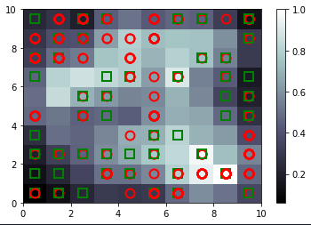

# Fraud-Detection-Using-SOMs
This repository is based on Self-Organizing Maps in which it detects potentials frauds on a dataset of customer applications in a bank for applying for a credit card.

<h1>Building a SOM :</h1>

<h4>Self organizing Map - An unsupervised deep learning model.</h4>

<h2>Implementation:</h2>

Here I have implemented a Self-Organizing Map in Python in which it solves a business problem(i.e Fraud Detection) using a particular dataset.

Say we have the details of the customers who are applying for an advanced credit card in a bank.
Here the SOM tries to detet potential fraud based on the information given.

Since we are using an unsupervised deep learning model we will identify some patterns in a high-dimensional dataset with non-linear relationships.
And here one of these patterns will be potential frauds.

<h3>Stage - 1 :</h3>
Importing our essential libraries such as
1)Numpy
2)Matplotlib.pyplot
3)pandas

<h3>Stage -2 : Importing the required dataset</h3>

The data used in this repository is actually taken from the UCI Machine Learning Repo
This dataset is actually known as the Statlog(Australian Credit Approval) Dataset.

<h2>Short Summary on how this actually works:</h2>
	This dataset is about credit card applications.It's attributes have been changed to meaningless symbols for privacy and protection.
Here we have totally 14 attributes in which 6 are numerical and 8 are categorical.

Note : Here our deep learning model makes a customer segmentation in our dataset so that one of the segments will contain customers who potentially cheated.
All these customer info are the inputs for our network.Here these input points are going to be mapped in the output space and in-between them we will have
a neural network composed of neurons.Initialisation of vector of weights of the neurons are of the same size of the vector of the customer.

Hence for each customer,outpu for that customer will be the neuron which is closest to that customer and this neuron is called "The winning node" for each customer.
For each customer the winning node will be the neuron which is basically similar to that customer.Then we use neighbourhood functions to update the weights to the 
neighbours of the winning node to move them closer to the point.Each time we repeat this to every customer again and again,the output space decreases and loses dimensions until
it reaches to the point where the output space stops decreasing.So that will be the moment when we obtain our SOM in 2D with all the winning nodes are identified.

So now we will be getting closer to the frauds.Since a fraud is not based on general rules,they will actually be the outlying neurons in this 2D SOM as these outlying neurons
are far from the major neurons that actually follow the rules.

To detect these outlying neurons we would need the MEAN INTERNEURON DISTANCE.For each neuron we are going to find the the mean of the euclidean distance between that neuron 
and the neurons in its neighbourhood that we will define.Then after finding the outlying neurons we will use inverse mapping functions to identify the the customers who are
associatd with these winning nodes.

<h3>Stage - 3: Creating Subsets</h3>

Now we split the datasets into 2 subsets where one(x) will have all the attributes of the customer and the other(y) will have the info of whether the application of the customer 
has been approved or not.

<h5>Note:</h5>
Since we are using unsupervised deep learning here and not having values that will either 0 or 1 for each customer we will only use 'x' dataset during training .i.e no dependent 
variable is considered here.

<h3>Stage - 4: Feature Scaling</h3>

We do it because since this is a high dimensional dataset with a lot of non-linear relationships we will require high computations here and to make it eaier we use feaature
scaling here.

<h3>Stage - 5 : Training the Som</h3>

For this we will be using the minisom.A licensed open source SOM implementation.

Import minisom first.
Then declaring the som itself by creating a class object from the library we imported which is MiniSom.
For a more precise on ,we can use a bigger map but for a visualisation process we can use a moderate one.

MiniSom(x(rows) ,y(cols) ,input_len(no of features in x) ,sigma(radius of diff neighbourhoods in the grid) , learning_rate(decides how much the weights are updated during each iteration),decay_function(can be used to improve the convergence)).

Higher the learning rate,faster will be the convergence and lower the learning rate the longer the SOM will take time to be built.
Learning rate default value is 0.5.
In this model we are not gonna use decay_fuction,hence it's gonna be None.

After creating a class object,now we have to randomly declare the weights for our SOM.

After that we will be using a method called the "Train Random" on the SOM for it to train.
 
A method of class MiniSom
train_random(data(which is x,the dataset needed to be trained),num_iteration(number of iterations to be repeated))

we are gonna use 100 iterations.

And now after executing this without any errors,our SOM is now trained.

By completing this training, our required patterns are now identified on the SOM ( :-) ).

<h3>Stage - 6 : Visualisation of the patterns by plotting the SOM</h3>

Note: The higher the MID,the more the winning node is far away from its neighbours,hence a high chance of being an outlier.
Hence we take the winning nodes with high MID as potential frauds.

Hence now we import the librries required for plotting.Since we are going to make a specific graph for the SOM we will be importing functions from pylab such as
1)bone
2)pcolor
3)colorbar
4)plot 
5)show.

First we initialise a figure that a kind of a seperate window that will contain the map.
For this the 'bone' function is used.

Next is to put different winning nodes on the map adding the info of the mean distance of all the winning nodes identified.
And this will be differentiated with different colors using the pcolor functions.
For getting the mean distances we use a specific method called the distance map method which returns all the distances of the  winning nodes as a matrix.
Now since we need to get the correct order for the pcolor function we take the transpose of the matrix

Next we add the colorbar to get the legends so that we will get to know whether the Lightest/Darkest color coresponds to the highest/lowest value.
Here in this project we get the lightest color depicts the largest values.Hence we can see that the nodes with the white colors are actually outlying nodes.

Now to the make the map more user-friendly we can add marker-distinctions to show and differentiate between the customers who got approved between those who have cheated.
Hence wwe define appropriate colors and markers.
After that we are going to loop over all the customers,and for every winning node of that customer we assign appropriate markers with colors.
Here we used,
'Red Circle' - Not Approved.
'Green Square' - Approved.

For looping we used two variables i and x where,
i - for each row
x - for each vector of the customer.
Inside the loop we get the winning node.
	we get the winning node for each customer by using the method 'winner' and place the marker on it and we will put the marker on the center of the winning node.
w[0] - x co-ordinate of the winning node.
w[1] - y co-ordinate of the winning node.
But these two are actually the co-ordinates of the lower left corner of the square. And for putting it on the center of the square we add 0.5 to each co-ordinate.

Now to assign the correct marker to the respective customer.For that we use the 'y' dataset which we seperated as a seperate subset on stage-3 as it contains the info of whether the customer got 
approval or not.
markers[y[i]] - i is the index variable of the customer and y[i] tells us whether 0/1 i.e whether he got approval or not. so if y[i] is 0 then it will be marker[0] and marker[0] is 'o',  a circle.
And the same case for color too.Here we are colouring only the edge of the marker and nothing inside it.Hence thse lines are coded.
 markeredgecolor=color[y[i]],
 markerfacecolor='None',
Also we define the marker size as 10 and edgewidth as 2.
And when executing this successfully we get a pefect SOM.

<h3>Stage-7: Finding the Frauds from the SOM</h3>

First thing is to get all the mappings in the SOM.
Hence we use the method 'win_amp' whichh will return a dictionary of all customer mappings. 
Every element in the dictionary will correspond to a winning node which will have a list of customers who are associated with that winning node.
Then we concatenate the reqiured list and while using the inverse _transform method in Feature Scaling to reverse the scaling we get the required fraud details of the customer applications.

<h3>SOM without Marker</h3>

<h3>SOM with Marker</h3>

<h6>Project Status : </h6>Ongoing
<h6>Upcoming Update :</h6> Auto Detection in Light  Areas

